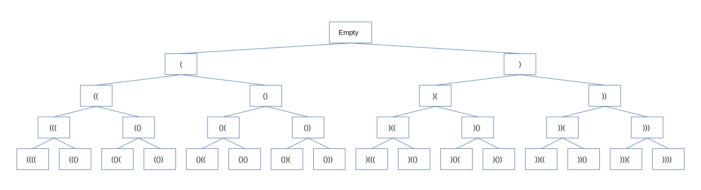
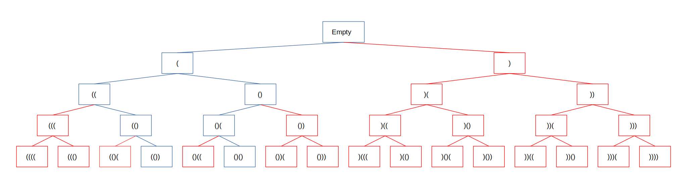

# Write Up

## Approach

This problem is best served thought about in steps of constraints.

## Manual

As we manually build a string of parenthesis, you have two choices. Add an open paren or a closing paren. This lends itself to a tree structure where each character addition is a child node of the state of the string before it.

## Generate all expressions

Next, since we can express this problem as repeating a subproblem (adding an open and close paren) we can write this recursively. The base case is if the string length is 2\*N where N is the number of pairs of parenthesis passed in. Since there's two options for adding the next character at each step, there will need to be two subcalls generated at each call. We can use a stack to maintain the running string as we go up and down the tree. We'll pop the latest character from the running value when each subcall returns so we can backtrack up the tree.

We now have an algorithm that generates all possible iterations of a string consisting of 2^N opening an closing parenthesis. But most of these generated values aren't valid parenthesis expressions. We could filter them out after the fact but that would result in an additional 2^N time to inspect each one for validity. Instead, using the contraints of what a valid expression of parenthesis is, we can just opt not to go down a branch of a tree if we know there's no possibility of a valid output.

## Pruning the tree

We can wrap each subcall in a conditional to ignore going down that branch and subtree. The two constraints of a valid expression will guide us in whether or not we continue down a branch. Any value generated after adding an open paren such that the resulting number of opens is greater than N would be invalid since there's not enough characters left to add enough closing parens. Additionally, adding a closing parenthesis that has no associated opening paren would result in all subsequent values to be invalid. This results in two conditionals. For the open subtree, we check to make sure the count of opens is less than N. For the close subtree, we check if the count of closes is less than the number of opens.

## Time Complexity

The leading term in the time complexity will be O(2^2N) since there's two possibilities for each position and 2N positions.

## Space Complexity

O(2N) space since there's a stack used to maintain the running candidate and a result array
